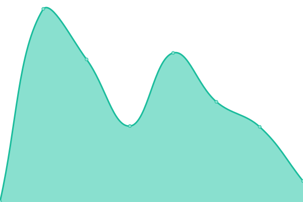
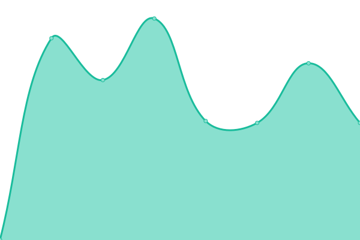

# [📈 Live Status](https://pokkocms.github.io/pokko-status): <!--live status--> **🟩 All systems operational**

This repository contains the open-source uptime monitor and status page for [Pokko](https://www.pokko.io/), powered by [Upptime](https://github.com/upptime/upptime).

With [Upptime](https://upptime.js.org), you can get your own unlimited and free uptime monitor and status page, powered entirely by a GitHub repository. We use [Issues](https://github.com/pokkocms/pokko-status/issues) as incident reports, [Actions](https://github.com/pokkocms/pokko-status/actions) as uptime monitors, and [Pages](https://pokkocms.github.io/pokko-status) for the status page.

<!--start: status pages-->
<!-- This summary is generated by Upptime (https://github.com/upptime/upptime) -->
<!-- Do not edit this manually, your changes will be overwritten -->
<!-- prettier-ignore -->
| URL | Status | History | Response Time | Uptime |
| --- | ------ | ------- | ------------- | ------ |
|  [Pokko](https://www.pokko.io) | 🟩 Up | [pokko.yml](https://github.com/pokkocms/pokko-status/commits/HEAD/history/pokko.yml) | 

 235ms
     
 | 

<a href="https://status.pokko.io/history/pokko">100.00%</a>
    

|  [Pokko - au-syd1](https://au-syd1.pokko.io) | 🟩 Up | [pokko-au-syd1.yml](https://github.com/pokkocms/pokko-status/commits/HEAD/history/pokko-au-syd1.yml) | 

 796ms
     
 | 

<a href="https://status.pokko.io/history/pokko-au-syd1">100.00%</a>
    

|  [Pokko - auth service](https://id.pokko.io) | 🟩 Up | [pokko-auth-service.yml](https://github.com/pokkocms/pokko-status/commits/HEAD/history/pokko-auth-service.yml) | 

 790ms
     
 | 

<a href="https://status.pokko.io/history/pokko-auth-service">100.00%</a>
    

<!--end: status pages-->

[**Visit our status website →**](https://pokkocms.github.io/pokko-status)

## 📄 License

- Powered by: [Upptime](https://github.com/upptime/upptime)
- Code: [MIT](./LICENSE) © [Pokko](https://www.pokko.io/)
- Data in the `./history` directory: [Open Database License](https://opendatacommons.org/licenses/odbl/1-0/)
